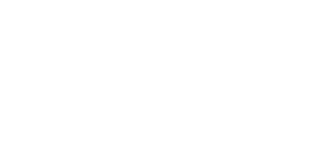
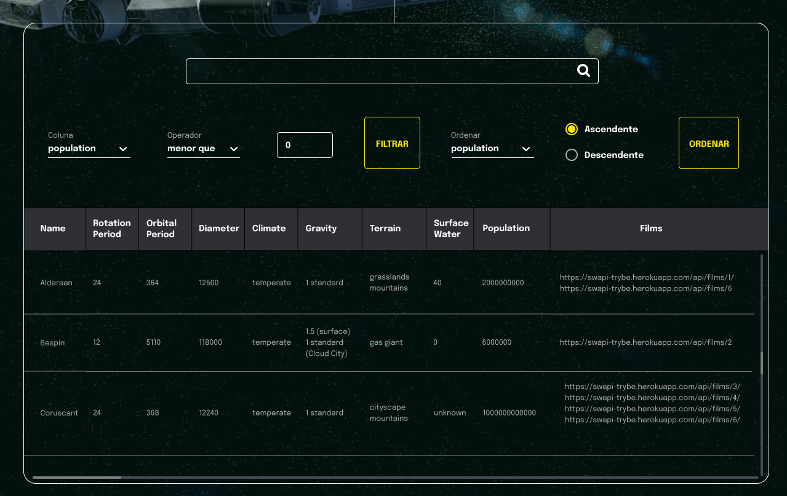

<p align="center">
  
</p>

## 📋 Sobre o projeto
Veja informações de planetas do universo de star wars



[](https://www.figma.com/file/Z7MzAgaMHyd4DYaLGQX830/%5BProjeto%5D%5BFrontend%5D-StarWars?node-id=0%3A1&t=tCRhp0H0ojFjqnxR-1)
> estilização não aplicada

## 💻 Tecnologias
- React
- Context API

## ✨ Funcionalidades 
- Buscar planetas por nome
- Filtros diversos
- Encadeamento de filtros
- Ordernação por diferentes variáveis

## 🧠 Aprendizado
Durante esse projeto aprendi a trabalhar com Context API, filtros e a utilização de hooks no react

## 📦 Inicialização
```bash
npm i
```
```bash 
npm start
```
